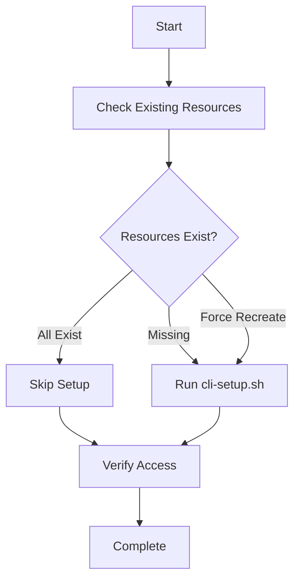
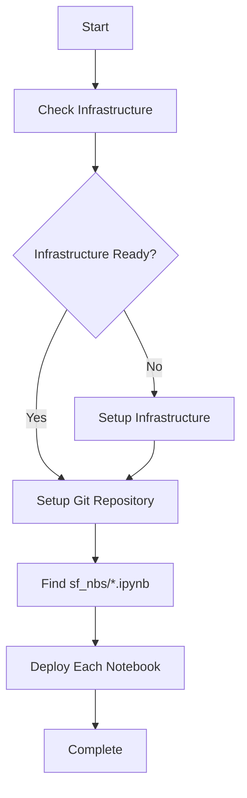

# GitHub Actions Setup for Snowflake ML Pipeline

This guide shows how to set up automated deployment of Snowflake notebooks using GitHub Actions.

## 🏗️ Infrastructure-as-Code Approach

We now have **three GitHub Actions workflows** that work together:

### 1. **Infrastructure Setup** (`setup-infrastructure.yml`)
- **Purpose**: Sets up Snowflake infrastructure using `cli-setup.sh`
- **Triggers**: Manual dispatch, or called by other workflows
- **Features**:
  - ✅ **Idempotent**: Safe to run multiple times, won't recreate existing resources
  - ✅ **Environment-aware**: Supports dev/staging/production
  - ✅ **Force recreate**: Option to drop and recreate resources (use carefully!)
  - ✅ **Verification**: Tests all infrastructure components after setup

### 2. **Notebook Deployment** (`deploy-notebooks.yml`) 
- **Purpose**: Deploys notebooks from `sf_nbs/` directory
- **Triggers**: Push to main with `sf_nbs/` changes, or manual dispatch
- **Features**:
  - ✅ **Infrastructure checking**: Verifies infrastructure exists first
  - ✅ **Auto-setup**: Can call infrastructure setup if needed
  - ✅ **Git integration**: Uses Snowflake Git repositories
  - ✅ **CLI-first**: Prefers CLI commands over SQL

### 3. **Full Deployment** (`full-deployment.yml`)
- **Purpose**: Orchestrates complete infrastructure + notebook deployment
- **Triggers**: Manual dispatch only
- **Features**:
  - ✅ **Complete control**: Choose infrastructure and/or notebooks
  - ✅ **Environment selection**: Deploy to different environments
  - ✅ **Status reporting**: Comprehensive deployment summary

## 🚀 Quick Start

### Option A: Full Deployment (Recommended for first time)
1. Go to **Actions** tab in your repository
2. Click **"Full ML Pipeline Deployment"**
3. Select your environment and options:
   - ✅ Setup infrastructure: `true`
   - ✅ Deploy notebooks: `true` 
   - ❌ Force recreate: `false` (unless you need to rebuild)
4. Click **"Run workflow"**

### Option B: Automatic Notebook Deployment
1. Add notebooks to `sf_nbs/` directory
2. Commit and push changes
3. GitHub Actions automatically deploys when `sf_nbs/` files change

### Option C: Infrastructure Only
1. Go to **Actions** → **"Setup Infrastructure"**
2. Choose environment and run
3. Later run notebook deployment separately

## 📁 Directory Structure

```
your-repo/
├── sf_nbs/                     # 📓 Put your notebooks here
│   ├── ml_pipeline.ipynb       # Your main ML pipeline
│   ├── data_prep.ipynb         # Data preparation notebook
│   └── model_training.ipynb    # Model training notebook
├── .github/workflows/
│   ├── setup-infrastructure.yml    # 🏗️ Infrastructure setup
│   ├── deploy-notebooks.yml        # 📓 Notebook deployment  
│   └── full-deployment.yml         # 🚀 Complete orchestration
├── cli-setup.sh               # Infrastructure setup script
└── scripts/                   # Helper scripts
    ├── setup-github-secrets.sh
    ├── test-notebook-deployment.sh
    └── test-workflow-locally.sh
```

## ⚙️ Configuration

### Required GitHub Secrets & Variables

**Secrets** (encrypted):
- `SNOWFLAKE_PASSWORD`: Your Snowflake password

**Variables** (visible):
- `SNOWFLAKE_ACCOUNT`: trb65519 (your account)
- `SNOWFLAKE_USER`: jd_service_account_admin 
- `SNOWFLAKE_ROLE`: ACCOUNTADMIN
- `SNOWFLAKE_WAREHOUSE`: HOL_WAREHOUSE
- `SNOWFLAKE_DATABASE`: HOL_DB
- `SNOWFLAKE_SCHEMA`: HOL_SCHEMA

### Automated Setup
Run this script to configure GitHub secrets automatically:
```bash
./scripts/setup-github-secrets.sh
```

## 🔄 Workflow Logic

### Infrastructure Setup Workflow


### Notebook Deployment Workflow


## 🎯 Deployment Targets

Each notebook in `sf_nbs/` becomes:
- **File**: `sf_nbs/ml_pipeline.ipynb`
- **Snowflake**: `HOL_DB.HOL_SCHEMA.ML_PIPELINE_NOTEBOOK`

## 🔧 Infrastructure Components

The infrastructure setup creates:

### Core Resources
- **Database**: `HOL_DB`
- **Schema**: `HOL_SCHEMA`  
- **Warehouse**: `HOL_WAREHOUSE`
- **Compute Pool**: `HOL_COMPUTE_POOL_HIGHMEM`

### Integration & Access
- **External Access**: `ALLOW_ALL_ACCESS_INTEGRATION`
- **Git Repository**: `ML_PIPELINE_REPO`
- **Runtime**: `SYSTEM$BASIC_RUNTIME`

### Sample Data
- **Table**: `REVIEWS` (299,900 rows of sample data)
- **Stage**: For data loading and notebook files

## 🧪 Testing Locally

Before pushing to GitHub, test your setup:

```bash
# Test infrastructure setup
./scripts/test-workflow-locally.sh

# Test notebook deployment
./scripts/test-notebook-deployment.sh

# Test specific notebook
./scripts/test-notebook-deployment.sh sf_nbs/my_notebook.ipynb
```

## 📋 Troubleshooting

### Common Issues

**"Infrastructure not ready"**
- Run infrastructure setup workflow first
- Check Snowflake account permissions
- Verify GitHub secrets/variables are set

**"No notebooks found in sf_nbs"**
- Create `sf_nbs/` directory
- Add `.ipynb` files to the directory
- Push changes to trigger deployment

**"Git repository setup failed"**
- Check repository permissions
- Verify GitHub repository is accessible
- Try running with `force_recreate: true`

**"Compute pool not found"**
- Compute pools may need manual start in Snowflake
- Check compute pool status in Snowflake UI
- Ensure `HOL_COMPUTE_POOL_HIGHMEM` exists

### Debug Mode
Add this to workflow runs for verbose output:
```yaml
env:
  DEBUG: "true"
```

## 🔐 Security Best Practices

1. **Use service accounts** for Snowflake authentication
2. **Store passwords as secrets** (never in variables)
3. **Use least-privilege roles** when possible
4. **Review workflow logs** for sensitive data exposure
5. **Use environment protection rules** for production

## 🚀 Advanced Usage

### Environment-Specific Deployments
Create different GitHub environments (dev/staging/prod) with different variable values:

```yaml
# Different configs per environment
development:
  SNOWFLAKE_DATABASE: DEV_DB
  SNOWFLAKE_WAREHOUSE: DEV_WAREHOUSE

production:  
  SNOWFLAKE_DATABASE: PROD_DB
  SNOWFLAKE_WAREHOUSE: PROD_WAREHOUSE
```

### Custom Notebook Configuration
Notebooks are deployed with these settings:
- **Runtime**: `SYSTEM$BASIC_RUNTIME`
- **Compute Pool**: `HOL_COMPUTE_POOL_HIGHMEM` 
- **Warehouse**: From `SNOWFLAKE_WAREHOUSE` variable
- **External Access**: `ALLOW_ALL_ACCESS_INTEGRATION`

To customize, modify the `CREATE NOTEBOOK` SQL in `deploy-notebooks.yml`.

### Scheduled Execution
Add scheduled tasks for regular notebook execution:
```sql
CREATE TASK ML_PIPELINE_DAILY_TASK
WAREHOUSE = HOL_WAREHOUSE
SCHEDULE = 'USING CRON 0 9 * * * UTC'
AS
EXECUTE NOTEBOOK HOL_DB.HOL_SCHEMA.ML_PIPELINE_NOTEBOOK();
```

## 🎯 Next Steps

1. **Start with Full Deployment** to set up everything
2. **Add notebooks to sf_nbs/** directory  
3. **Push changes** to trigger automatic deployment
4. **Monitor execution** in Snowflake
5. **Set up scheduled tasks** for automation
6. **Scale to multiple environments** as needed

## 📚 Resources

- [Snowflake CLI Documentation](https://docs.snowflake.com/en/developer-guide/snowflake-cli/index)
- [Snowflake Notebooks](https://docs.snowflake.com/en/user-guide/ui-snowsight/notebooks)
- [GitHub Actions Documentation](https://docs.github.com/en/actions)
- [Snowflake Git Integration](https://docs.snowflake.com/en/developer-guide/git/git-overview) 