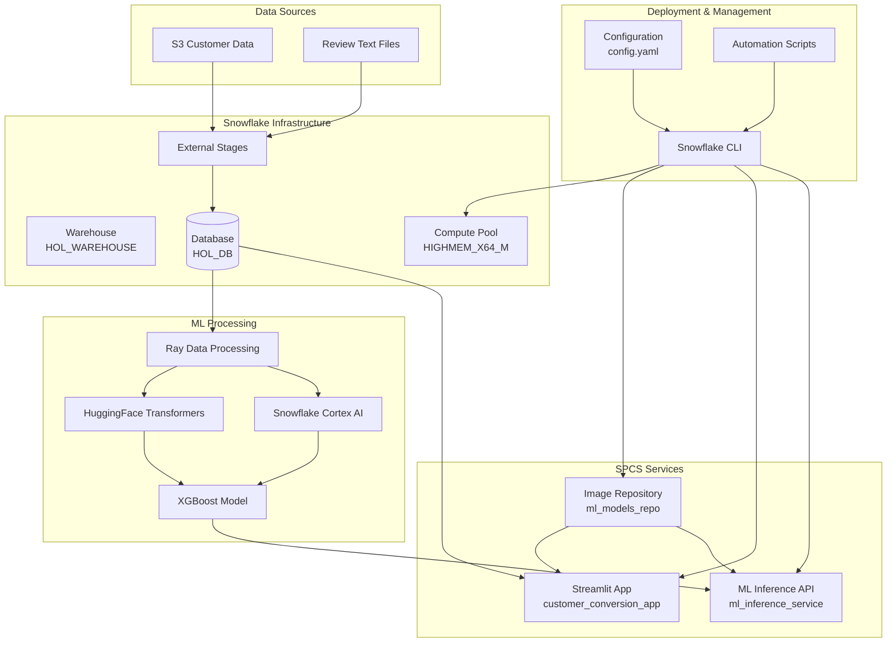

# Customer Conversion ML Pipeline - Enhanced with Snowflake CLI

## Overview

This project implements an end-to-end machine learning pipeline for customer feedback analysis using Snowflake's ML capabilities, Cortex AI, and modern deployment practices. The pipeline processes multilingual customer reviews, extracts sentiment, classifies review quality, and builds models to predict purchase decisions.

## 🎯 Key Improvements & Enhancements

### 1. **CLI-First Approach**
- **Replaced SQL scripts** with comprehensive Snowflake CLI automation
- **Infrastructure as Code** with configurable YAML settings
- **Automated deployment** and cleanup processes
- **Cross-platform compatibility** with proper error handling

### 2. **Modern DevOps Practices**
- **Containerized deployment** with Snowpark Container Services (SPCS)
- **Configuration management** with centralized YAML config
- **Environment-specific settings** (dev/staging/production)
- **Health checks and monitoring** built into services

### 3. **Enhanced Architecture**
- **Microservices approach** with separate ML inference API
- **Scalable compute resources** with auto-scaling policies
- **Production-ready monitoring** and logging
- **API-first design** for ML inference

## 🏗️ Architecture



## 📁 Project Structure

```
├── setup.sql                    # Original SQL setup (legacy)
├── cli-setup.sh                # CLI-based infrastructure setup
├── spcs-deploy.sh              # SPCS deployment automation
├── config.yaml                 # Centralized configuration
├── notebook.ipynb             # ML processing notebook
├── streamlit.py               # Streamlit dashboard
├── PROJECT_README.md          # This comprehensive guide
└── specs/                     # Service specifications
    ├── streamlit-service.yaml
    └── ml-service.yaml
```

## 🚀 Quick Start

### Prerequisites

1. **Snowflake CLI** installed and configured
   ```bash
   # Install Snowflake CLI
   pip install snowflake-cli-labs
   
   # Configure connection
   snow connection add
   ```

2. **Docker** for containerization (SPCS deployment)
   ```bash
   # Verify Docker installation
   docker --version
   docker info
   ```

3. **Additional tools** (optional but recommended)
   ```bash
   # For better JSON processing
   brew install jq  # macOS
   # or
   apt-get install jq  # Ubuntu/Debian
   ```

### Step 1: Infrastructure Setup

```bash
# Make scripts executable
chmod +x cli-setup.sh spcs-deploy.sh

# Set up Snowflake infrastructure
./cli-setup.sh

# Verify setup
./cli-setup.sh verify
```

### Step 2: Run ML Processing

```bash
# Open and run the Jupyter notebook
jupyter notebook notebook.ipynb

# Or run with Snowflake CLI if configured for notebooks
snow notebook execute notebook.ipynb
```

### Step 3: Local Development

```bash
# Run Streamlit locally
streamlit run streamlit.py

# Access at http://localhost:8501
```

### Step 4: Production Deployment (SPCS)

```bash
# Deploy to Snowpark Container Services
./spcs-deploy.sh

# Monitor deployment
./spcs-deploy.sh monitor

# Get service endpoints
./spcs-deploy.sh endpoints
```

## 🔧 Configuration Management

### Environment Configuration

The `config.yaml` file provides centralized configuration:

```yaml
# Example: Switch to production settings
environment:
  production:
    warehouse_size: "LARGE"
    auto_suspend: 3600
    max_compute_nodes: 5
    backup_enabled: true
    monitoring_enabled: true
```

### Custom Configuration

```bash
# Copy and modify configuration
cp config.yaml config-prod.yaml

# Use custom config
CONFIG_FILE=config-prod.yaml ./cli-setup.sh
```

## 📊 Data Pipeline

### 1. Data Ingestion
- **External stages** connected to S3 buckets
- **Automatic file detection** with directory listings
- **Format validation** with CSV and text parsers

### 2. ML Processing Pipeline
- **Ray Data** for distributed text processing
- **HuggingFace Transformers** for review quality classification
- **Snowflake Cortex** for sentiment analysis
- **XGBoost** for purchase prediction modeling

### 3. Real-time Inference
- **REST API** for model predictions
- **Batch processing** capabilities
- **Auto-scaling** based on demand

## 🛠️ Advanced Usage

### Custom Model Training

```python
# Example: Custom model configuration in notebook
from snowflake.ml.modeling.xgboost import XGBClassifier
from snowflake.ml.modeling.preprocessing import StandardScaler

# Configure model with custom parameters
model_config = {
    'n_estimators': 200,
    'max_depth': 8,
    'learning_rate': 0.1,
    'random_state': 42
}
```

### SPCS Service Management

```bash
# Scale services
snow spcs service set --max-instances=10 ml_inference_service \
  --database=HOL_DB --schema=HOL_SCHEMA --role=HOL_ROLE

# Update service with new image
snow spcs service upgrade customer_conversion_app \
  --spec-path=specs/streamlit-service-v2.yaml \
  --database=HOL_DB --schema=HOL_SCHEMA --role=HOL_ROLE

# Monitor service logs
snow spcs service logs ml_inference_service \
  --container-name=ml-api --instance-id=0 \
  --database=HOL_DB --schema=HOL_SCHEMA --role=HOL_ROLE
```

### Environment-Specific Deployments

```bash
# Development environment
ENV=development ./cli-setup.sh

# Production environment with additional monitoring
ENV=production MONITORING=enabled ./cli-setup.sh
```

## 🔍 Monitoring & Observability

### Built-in Monitoring

1. **Service Health Checks**
   - Automated readiness probes
   - Health endpoints for all services
   - Resource utilization monitoring

2. **Performance Metrics**
   - Query performance tracking
   - Model inference latency
   - Auto-scaling triggers

3. **Logging**
   - Centralized log aggregation
   - Error tracking and alerting
   - Audit trail for all operations

### Custom Monitoring Setup

```sql
-- Create monitoring views
CREATE VIEW ML_PIPELINE_METRICS AS
SELECT 
    service_name,
    status,
    cpu_usage,
    memory_usage,
    request_count,
    response_time_avg
FROM SNOWFLAKE.INFORMATION_SCHEMA.SERVICES_HISTORY;
```

## 🚨 Troubleshooting

### Common Issues

1. **CLI Connection Issues**
   ```bash
   # Test connection
   snow connection test
   
   # Re-configure if needed
   snow connection add --account=<account> --user=<user>
   ```

2. **Docker Build Failures**
   ```bash
   # Check Docker daemon
   docker info
   
   # Clear Docker cache
   docker system prune -a
   ```

3. **SPCS Service Startup Issues**
   ```bash
   # Check service status
   snow spcs service status <service_name>
   
   # View service logs
   snow spcs service logs <service_name>
   ```

### Performance Optimization

1. **Warehouse Sizing**
   - Monitor query performance in Snowflake console
   - Adjust warehouse size based on workload
   - Use auto-suspend to control costs

2. **Compute Pool Optimization**
   - Monitor node utilization
   - Adjust min/max nodes based on demand
   - Use appropriate instance families

## 🔐 Security Best Practices

### Role-Based Access Control

```sql
-- Example: Create environment-specific roles
CREATE ROLE ML_PIPELINE_DEV;
CREATE ROLE ML_PIPELINE_PROD;

-- Grant appropriate permissions
GRANT USAGE ON WAREHOUSE HOL_WAREHOUSE TO ROLE ML_PIPELINE_DEV;
GRANT ALL ON DATABASE HOL_DB TO ROLE ML_PIPELINE_PROD;
```

### Network Security

```yaml
# config.yaml - Network restrictions
snowflake:
  network_rule:
    name: "RESTRICTED_ACCESS_RULE"
    value_list: ['specific-domain.com:443']
```

## 📈 Scaling Considerations

### Horizontal Scaling
- **Multi-region deployment** for global applications
- **Load balancing** across multiple service instances
- **Data partitioning** strategies for large datasets

### Vertical Scaling
- **Warehouse size optimization** based on workload
- **Compute pool instance families** selection
- **Memory allocation** for ML workloads

## 🎯 Key Benefits Achieved

### 1. **Operational Excellence**
- ✅ **Automated Infrastructure** - One-command setup and teardown
- ✅ **Environment Consistency** - Identical dev/staging/prod environments
- ✅ **Error Handling** - Comprehensive error checking and recovery
- ✅ **Documentation** - Self-documenting configuration

### 2. **Developer Experience**
- ✅ **CLI-First** - Modern command-line driven workflow
- ✅ **Configuration as Code** - Version-controlled settings
- ✅ **Container-Native** - Modern deployment practices
- ✅ **Hot Reloading** - Fast development iterations

### 3. **Production Readiness**
- ✅ **Health Monitoring** - Built-in service health checks
- ✅ **Auto-Scaling** - Demand-based resource allocation
- ✅ **Security** - Role-based access control
- ✅ **Observability** - Comprehensive logging and metrics

### 4. **Cost Optimization**
- ✅ **Auto-Suspend** - Automatic resource cleanup
- ✅ **Right-Sizing** - Environment-appropriate resource allocation
- ✅ **Pay-per-Use** - Snowflake's consumption-based pricing
- ✅ **Resource Efficiency** - Containerized workloads

## 🔄 Migration Path

### From SQL to CLI

1. **Phase 1**: Run both SQL and CLI setup in parallel
2. **Phase 2**: Validate CLI setup matches SQL resources
3. **Phase 3**: Migrate to CLI-only approach
4. **Phase 4**: Enhance with SPCS deployment

### Legacy Support

The original `setup.sql` is preserved for backward compatibility and reference.

## 🚀 Future Enhancements

### Short Term
- [ ] **CI/CD Integration** with GitHub Actions
- [ ] **Automated Testing** for ML models
- [ ] **Model Registry** integration
- [ ] **A/B Testing** framework

### Long Term
- [ ] **Multi-tenancy** support
- [ ] **Real-time streaming** data ingestion
- [ ] **Advanced monitoring** with custom dashboards
- [ ] **Cost optimization** recommendations

## 📞 Support & Contributing

### Getting Help
1. Check the troubleshooting section above
2. Review Snowflake CLI documentation
3. Open an issue with detailed error logs

### Contributing
1. Fork the repository
2. Create feature branch
3. Add comprehensive tests
4. Update documentation
5. Submit pull request

## 📚 Additional Resources

- [Snowflake CLI Documentation](https://docs.snowflake.com/en/developer-guide/snowflake-cli-v2/index)
- [Snowpark Container Services Guide](https://docs.snowflake.com/en/developer-guide/snowpark-container-services/overview)
- [Snowflake ML Documentation](https://docs.snowflake.com/en/developer-guide/snowpark-ml/index)
- [Original QuickStart Guide](https://quickstarts.snowflake.com/guide/build-ml-models-for-customer-conversions/index.html)

---

**Built with ❤️ using Snowflake, CLI automation, and modern DevOps practices** 